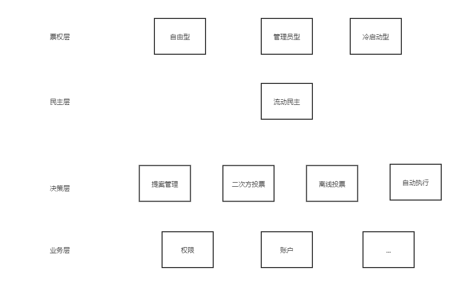

# Gov-Arts

个人对治理代码重构的一个尝试，尝试做一个链上治理开发框架。用户使用这个框架后，可以轻松为自己的业务合约赋予丰富的治理机制。

## 关键特性

- 票权维护、投票管理、业务代码相分离
- 多种票权管理模型，包括管理员模型、委员会模型、自由竞争模型、流动民主等模型
- 支持离线投票、二次方投票等
- 支持自动执行模式
- 用户可根据自己的需求快速实现治理

## 架构

## 设计思路

我阅读了FISCO BCOS社区合作伙伴代码、各开源代码，感觉有不少可吸收的地方，加上一些自己的思考，现在整理成大致的设计思路。

### 票权的设计

票权模块专门管理票权的生命周期。它的设计思路如下：

首先，有一张表维护着各个角色的票权。接下来是如何管理票权的生命周期，例如生成、转移、销毁，我写了三种可能的票权方案：

- 自由型。票权由初始某个人发行给各人，各人可以自由交易。灵感源自ICO、ERC20等。
- 管理员模型。管理员一个人决定了系统中各个成员的权重。灵感源自账户、权限的治理。
- 委员会模型。系统中第一个人是管理员。灵感源自账户、权限、FISCO BCOS某社区伙伴的项目。

### 民主的设计

民主只需设计流动民主即可。该民主包含了通常所说的直接民主、间接民主、流动民主。在实现上，存在一张表，记录着每个人都把自己的票权代理给了谁。当转移权重的时候，需要连着票权一起转让，比如A委托了C，B委托了D，那么现在A把部分资产转移给了B，就变成了C的票权自然也降低了，而B的票权自动增加。

一点儿思考：

我本来还想设计“分散代理方案”，允许每个人把自己的权重拆分为不同部分代理给不同人，但细想这样对二次方投票是不友好的。举个例子，我要花100权重获取10票，如果允许分散代理权重，那么我要获取这10票，那么只需要把10个权重分散代理给10个不同人就可以了，完全绕过二次方投票。所以为了二次方投票这么棒的东西，还是不要搞什么分散代理吧。

### 投票、执行的设计

#### 二次方投票
权重不等于真的票权。投票的时候，可以通过一个转换函数，将权重开方，得到真实票数（votes）

#### 离线投票

这是一种不访问区块链也能调用智能合约的方法，请参考EIP-712。简单来说，如果我不想直连区块链（例如由于手续费昂贵），那么我可以把我的请求做签名，委托给某人，此人向链上转发交易。链上通过ecrecover恢复出我的地址（先不管国密支持问题），然后继续执行我的业务即可。

#### 其他
像提案管理、自动执行，都是老生长谈了，略。

